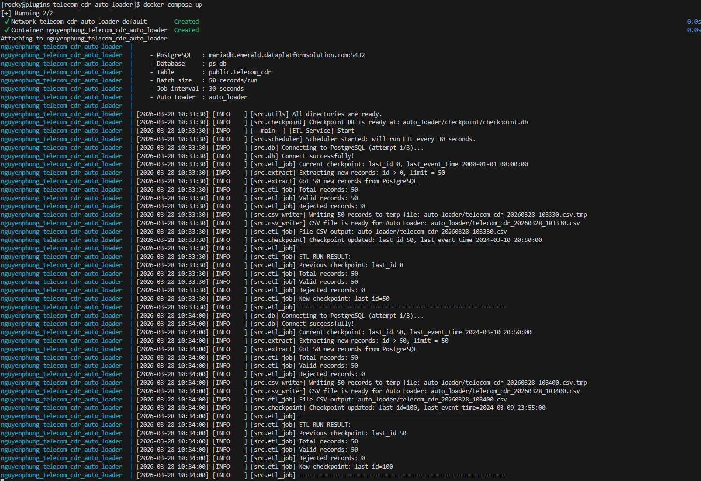

# Telecom CDR Auto Loader - Project Report

This repository contains my implementation for the **Telecom CDR Auto Loader** Training Assignment. It serves as a complete, end-to-end data ingestion flow covering ETL extraction, data transformation, atomic file delivery, and configuration for auto-loading into a MariaDB target database.

---

## 1. Architecture

The ETL service is designed as an autonomous, decoupled pipeline that synchronizes PostgreSQL data into a file-based ingestion folder for the Auto Loader to pick up.

```text
┌─────────────────────────────────────────────────────────────┐
│                        ETL SERVICE                          │
│                                                             │
│  scheduler.py → etl_job.py (run_etl_job)                    │
│        │                                                    │
│        ▼                                                    │
│  extract.py ──── read from PostgreSQL (id > last_id)        │
│        │                                                    │
│        ▼                                                    │
│  transform.py ── transform, validate, split valid/rejected  │
│        │                                                    │
│        ├──► csv_writer.py ──► auto_loader/*.csv             │
│        │                           │                        │
│        │                     (Auto Loader)                  │
│        │                      ↓         ↓                   │
│        │                     s/        f/                   │
│        │                                                    │
│        └──► csv_writer.py ──► auto_loader/rejected/*.csv    │
│                                                             │
│  checkpoint.py ─── auto_loader/checkpoint/checkpoint.db     │
└─────────────────────────────────────────────────────────────┘
```


---

## 2. Code Structure

```text
telecom_cdr_auto_loader/
├── pyproject.toml              ← Project configuration (uv)
├── build.bat                   ← Docker build script helper
├── .env.example                ← Environment variables template
├── .env                        ← Environment variables
├── src/                        ← Core application logic
│   ├── main.py                 ← Main entry point & init
│   ├── config.py               ← Loads .env
│   ├── db.py                   ← Connects to Postgres
│   ├── scheduler.py            ← Runs loops on schedule
│   ├── etl_job.py              ← The complete ETL iteration workflow
│   ├── extract.py              ← Gathers new db rows
│   ├── transform.py            ← Business logic and validations
│   ├── csv_writer.py           ← Atomic file writers
│   ├── checkpoint.py           ← SQLite Checkpoint updater
│   └── logger.py               ← Logging settings
└── docker/
    ├── Dockerfile              ← Application container image build
    └── docker-compose.yaml     ← PLUGINS server deployment config
```

### 2.1. Module Breakdown & Execution Flow

Following the Architecture diagram, the source code (`src/`) executes logically through all 10 modules. The core business logic and solutions natively reside within these components:

1. **`config.py` (Configuration Manager)**
   This module acts as the single source of truth for the system's environment variables. It utilizes `python-dotenv` to read the `.env` file and exports crucial parameters (like `POSTGRES_HOST`, `SCHEDULE_INTERVAL_SECONDS`, and `BATCH_SIZE`) as Python constants, making them safely accessible globally across all other scripts without hardcoding values.

2. **`logger.py` (Logging Setup)**
   Serving as the application's diagnostic reporter, this file configures standard Python logging formats and output levels. It provides a `get_logger()` instantiation capability so that every subsequent module tracks execution events, errors, and success statistics uniformly onto console outputs.

3. **`db.py` (Database Connection Provider)**
   This module guarantees the network gateway connectivity to PostgreSQL. It evaluates connection parameters from `config.py` to yield a stable database connection. It securely encapsulates the session logic, incorporating basic fault handling components ensuring clean application drops if credentials skew.

4. **`main.py` (Entry Point & Initialization)**
   As the startup application layer, this script spins up the pipeline. It establishes the system-wide logging capabilities, triggers initialization parameters ensuring the embedded SQLite Checkpoint database is prepared (via `checkpoint.py`), and subsequently hands control of the ETL iterative functions over to the job scheduler.

5. **`scheduler.py` (Job Scheduler)**
   This acts as the timeline commander. It receives the target orchestration function (`run_etl_job`) and executes it cleanly inside an infinite continuous while-loop. It actively dictates the frequency of the pipeline iteration utilizing `time.sleep()`, delayed strictly tracing the configured `SCHEDULE_INTERVAL_SECONDS` timeout interval avoiding DB over-fetching.

6. **`etl_job.py` (The Orchestrator)**
   By exposing `run_etl_job()`, this script functions as the grand supervisor for an individual ETL iteration. It rules the exact sequential operational flow: reads the last checkpoint ID -> requests the extractor -> routes extraction limits to the transformer -> pulls the CSV writer -> updates the checkpoint ID finally. Designing this sequential lockdown ensures if one internal link fails, the chain safely throws aborts preventing false ID registrations.

7. **`extract.py` (Data Extractor)**
   Acting as the pipeline's connector hook, this script queries the PostgreSQL database securely utilizing the `db.py` driver connection. It queries for incremental data loads by strictly pulling batch records where the primary key `id` sits dynamically higher than the ongoing `last_id` stored inside the checkpoint. It limits its query ceiling by respecting the `BATCH_SIZE` configuration limits.

8. **`transform.py` (Parser & Validator / Logic Engine)**
   This is the pure execution engine addressing dataset logic requirements. It iterates over the gathered rows sanitizing structures: it parses tricky `event_time` Unix timestamps resolving them into comprehensive `YYYY-MM-DD HH:MM:SS` UTC outputs; it actively translates string metadata code parameters (`MO` & `MT` shift dynamically into `Outgoing` & `Incoming`); and performs required coordinate float conversions. Moreover, it actively extracts the derived field `duration_minutes` splitting securely from raw `duration_seconds`. Missing variables entirely bypass the writing batch line logic, being rejected purposefully inside isolation logic towards a `rejected/` sub-folder saving schema sanity.

9. **`csv_writer.py` (Atomic File Deliverer)**
   To actively prevent critical "Partial Load" issues—where an Auto Loader scanning a destination scans incomplete bits out of an open write-stream—this script invokes an OS-guaranteed atomic file processing sequence. It translates batch dictionaries storing content with a temporary `.tmp` extension wrapper (e.g., `data.csv.tmp`). Following it up immediately by slamming `os.fsync()` forcing local operating systems hardware cache flushes—it applies instantaneous file-system modification rename trigger (`os.replace`) shedding `.tmp` over into finalize `.csv`. The loader catches a flawless full document without ever clipping reading bitstreams.

10. **`checkpoint.py` (Persistence Tracker)**
    Designed to prevent Duplicate Data Loads natively securely. It navigates local interaction mapping straight upon an embedded SQLite micro-database. Through actively saving numeric ID increment parameters specifically *post-delivery* completing effectively at the end tail of an `etl_job` frame—it overrides duplicate insert tendencies perfectly. Relying on SQLite inherently overrides JSON corruption vulnerabilities caused primarily during sporadic container down-times. Allowing restarting Docker sequences matching completely exactly where it previous halted efficiently.

---

## 3. Setup (Local Usage)

### Dependencies
- Python 3.11+
- [uv](https://docs.astral.sh/uv/) package manager

### Installation Steps

1. **Clone & Virtual Environment:**
   Run the following to install all dependencies cleanly via `uv`.
   ```bash
   uv sync
   ```
2. **Environment Variables:**
   Copy the example and edit connection credentials:
   ```bash
   cp .env.example .env
   ```
   **Important variables in `.env`:**
   - `POSTGRES_HOST`: Source database host
   - `SCHEDULE_INTERVAL_SECONDS`: Sync interval limit
   - `BATCH_SIZE`: Limiter for extraction query

3. **Start the Service locally:**
   ```bash
   uv run python -m src.main
   ```

---

## 4. Deployment

The service is fully dockerized and built into the Plugins server running autonomously via Docker Compose mapping volumes directly back onto host limits allowing durable checkpoint states.

### Deploy instructions for PLUGINS Server:
Inside `/docker/`:
```bash
docker compose up
```


The docker composition mounts `/opt/data/loader/auto_loader_nguyenphung` volume mapping preserving file sync stability for Auto Loader external scans on Linux safely without losing internal DB trackers during teardowns!

